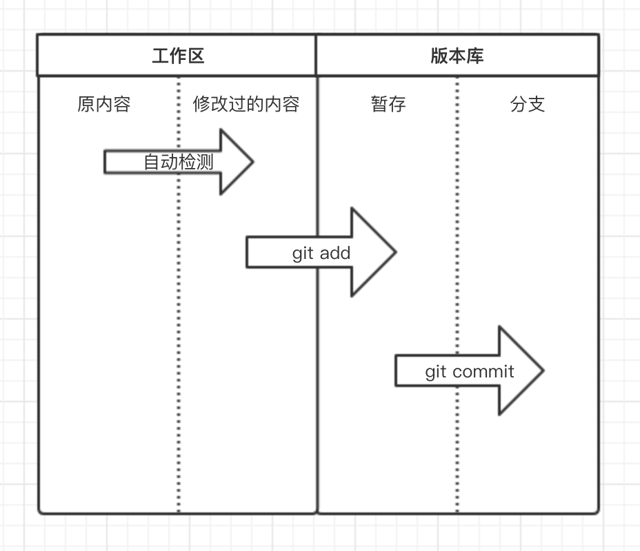

# git基础

## 安装git
[root@localhost ~]# git --version   
git version 1.8.3.1   #centos默认自带的版本是1.8，生产环境一般2.7以上
yum install curl-devel expat-devel gettext-devel openssl-devel zlib-devel gcc perl-ExtUtils-MakeMaker

wget https://github.com/git/git/archive/v2.20.0.zip
unzip v2.20.0.zip
cd git-2.20.0/
make prefix=/usr/local/git all
make prefix=/usr/local/git install
cp /usr/local/git/bin/* /usr/bin/
git --version
## git文件状态
按照文件的存放位置分：
在你自建的Git本地仓库中，有三个区域：
	Git仓库：是 Git 用来保存项目的元数据和对象数据库的地方。 这是 Git 中最重要的部分，从其它计算机克隆仓库时，拷贝的就是这里的数据。
	工作目录：是对项目的某个版本独立提取出来的内容。 这些从 Git 仓库的压缩数据库中提取出来的文件，放在磁盘上供你使用或修改。
	暂存区域：是一个文件，保存了下次将提交的文件列表信息，一般在 Git 仓库目录中。 有时候也被称作`‘索引’'，不过一般说法还是叫暂存区域。

按照文件的状态分：
工作目录下面的所有文件都不外乎这两种状态：已跟踪或未跟踪
未跟踪的文件的改动不受到Git的版本控制，即为Unstracked状态,还没有被git管理
已跟踪的文件，即被纳入版本控制的文件，又分为未修改（unmodified）、已修改（modified）、已暂存（staged）、已提交到版本库（committed）四种状态

 

# git基本使用
 	基础命令
git init，初始化，表示即将对当前文件夹进行版本控制。
git status，查看Git当前状态，如：那些文件被修改过、那些文件还未提交到版本库等。
git add 文件名，将指定文件添加到版本库的暂存状态。
git commit -m "xxx" 把暂存区的所有文件提交到仓库区，暂存区空空荡荡。
git push -u origin master 把仓库区的文件提交到远程仓库里。
git remote add origin https://github.com/name/name_cangku.git 把本地仓库与远程仓库连接起来。
git log，查看提交记录，即：历史版本记录

## 本地仓库

	全局配置
##添加用户名邮箱，git在提交时候会记录当前版本由那个用户提交
git config --global user.name "wangc"
git config --global user.email wangc@example.com

	创建本地仓库
mkdir test
cd test/
git init #初始化test目录，初始化后，会在当前目录自动创建 .git 文件夹，该文件是Git中最重要的文件夹，因为Git相关文件以及版本都将保存在该文件夹中，通过Git命令可以将所有版本保存在 .git 文件中
echo "print("hello")" >hello.py
git status
git add .   #添加当前目录下所有文件到暂存区
git commit -m '第一次提交' 
git log

##	远程仓库gitlab
	全局配置
#添加用户名邮箱，git在提交时候会记录当前版本由那个用户提交
git config --global user.name "Administrator"
git config --global user.email "admin@example.com"

	使用场景1：克隆远程仓库
git clone git@192.168.100.163:root/python-demo.git
cd python-demo
touch README.md
git add README.md
git commit -m "add README"
git push -u origin master

	使用场景2：推送现有文件夹
#假设本地已经有个test仓库了，但想把test里的代码，保存到远程python-demo仓库之上
mkdir test
cd test/
git init
touch hello.py
git remote add origin git@192.168.100.163:root/python-demo.git  #本地的仓库与Gitlab上的远程仓库做关联
git add .
git commit -m "Initial commit"
git push -u origin master
	使用场景3：项目迁移
git clone git@192.168.100.163:root/python-old.git    #原服务器代码地址
cd python-old
git remote rename origin old-origin   #首先将原来的origin重命名一下
git remote add origin git@192.168.100.163:root/python-new.git  #新服务器代码需要存放的地址
git push -u origin --all #上传到新服务器
git push -u origin --tags #上传tag

## 版本回滚
[root@localhost test]# vim app.py
[root@localhost test]# git add .
[root@localhost test]# git commit -m '第二次提交'
[root@localhost test]# git log
commit 7e3180eb85d99fb0d6166f909d5228899fc339bf (HEAD -> master)
Author: wangchuang <you@example.com>
Date:   Sun Jan 19 15:50:48 2020 +0800

    第二次提交

commit 9e1b2841ef1ada74d66a4c19b81da394b260c873
Author: wangchuang <you@example.com>
Date:   Sun Jan 19 15:21:00 2020 +0800

    第一次提交

[root@localhost test]# git reset --hard 9e1b2841ef1ada74d66a4c19b81da394b260c873
da394b260c873
HEAD 现在位于 9e1b284 第一次提交

#回滚倒是完成了，但如果某一天想要再回到回滚前的版本怎么办呢？
[root@localhost test]# git reflog
9e1b284 (HEAD -> master) HEAD@{0}: reset: moving to 9e1b2841ef1ada74d66a4c19b81da394b260c873
7e3180e HEAD@{1}: commit: 第二次提交
9e1b284 (HEAD -> master) HEAD@{2}: commit (initial): 第一次提交
[root@localhost test]# git reset --hard 7e3180e
HEAD 现在位于 7e3180e 第二次提交

##	分支管理
git branch 分支名称             创建分支
git checkout 分支名称          切换分支
git branch -m 分支名称        创建并切换到指定分支
git branch                          查看所有分支
git branch -d 分支名称         删除分支
git merge 分支名称              将指定分支合并到当前分支
git branch –merged   #查看哪些分支被合并了
git branch –no-merged #查看哪些分支没有合并

1)	branch称为分支，默认仅有一个名为master的分支。一般开发新功能流程为：开发新功能时会在分支dev上进行，开发完毕后再合并到master分支

[root@localhost test]# git branch dev  # 创建新分支，即：拷贝一份当前所在分支代码到新分支
[root@localhost test]# git checkout dev  # 切换到dev分支

[root@localhost test]# vim new.py
[root@localhost test]# git status
位于分支 dev
未跟踪的文件:
  （使用 "git add <文件>..." 以包含要提交的内容）

	new.py

提交为空，但是存在尚未跟踪的文件（使用 "git add" 建立跟踪）
[root@localhost test]# git add .
[root@localhost test]# git commit -m '新功能开发完毕'
[dev be42e4d] 新功能开发完毕
 1 file changed, 1 insertion(+)
 create mode 100644 new.py
[root@localhost test]# git checkout master
切换到分支 'master'

[root@localhost test]# git merge dev    # 将dev分支内容合并到master分支

更新 7e3180e..be42e4d
Fast-forward
 new.py | 1 +
 1 file changed, 1 insertion(+)
 create mode 100644 new.py

2)	按照着以上的流程进行开发，如果遇到上文开发到一般需要临时修复Bug的情况，可以按照下图的流程进行：

[root@localhost test]# git branch
* master
[root@localhost test]# git branch dev   # 创建dev分支用于开发新功能
[root@localhost test]# git checkout dev   # 切换到dev分支
 [root@localhost test]# vim new.py   # 开发新功能到一半，需要紧急修复Bug
 [root@localhost test]# git add .
[root@localhost test]#  git commit -m '新功能开发一半' 
[dev 162d717] 新功能开发一半
 1 file changed, 0 insertions(+), 0 deletions(-)
 create mode 100644 new.py

[root@localhost test]# git checkout master  #切换回master分支
 [root@localhost test]# git branch bug      #创建bug分支
[root@localhost test]# git checkout bug     #切换到bug分支
[root@localhost test]# vim bug.py       #修改bug
[root@localhost test]# git add .       
[root@localhost test]# git commit -m '紧急修复bug'       #提交bug
 [root@localhost test]# git checkout master     #切换回master
[root@localhost test]# git merge bug     #合并bug分子

[root@localhost test]# git checkout dev　　　＃继续开发
切换到分支 'dev'

