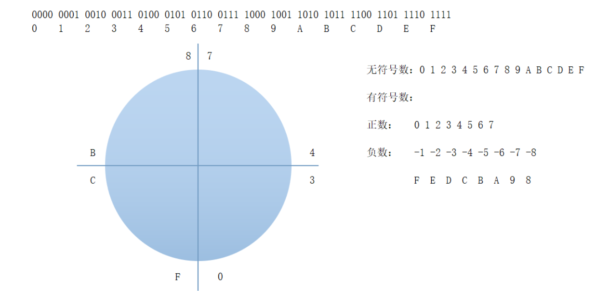
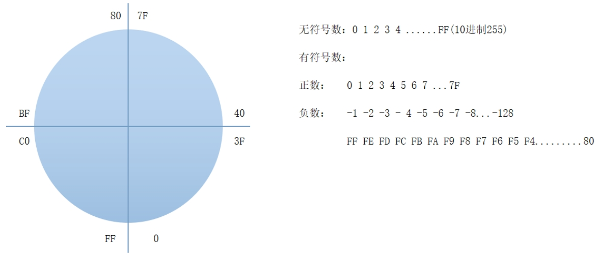
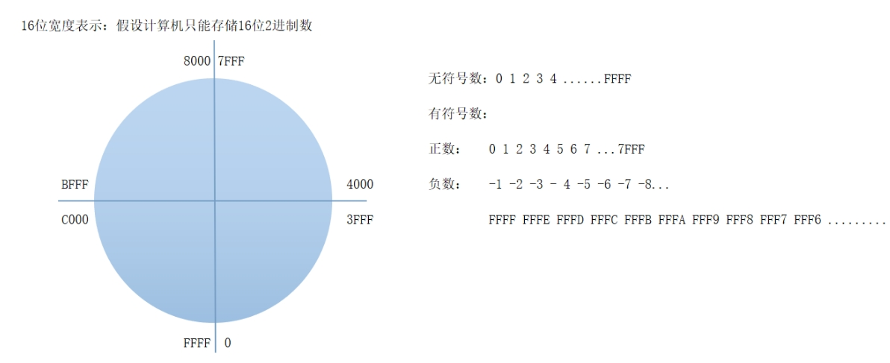
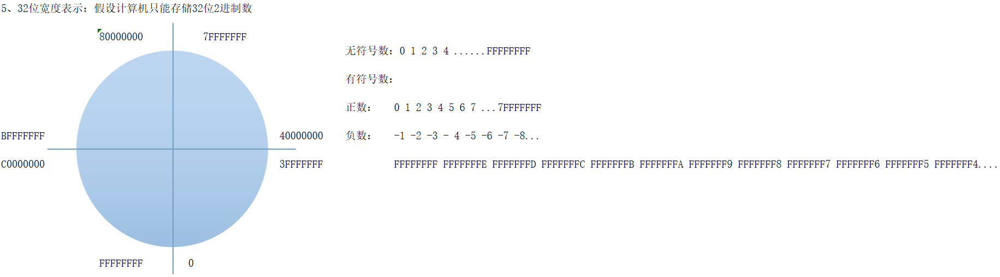

# 什么是数据宽度

计算机中存储的数据最终都是二进制存储的，计算机只认识1和0，但是不是一下子全部存进去的，而是分成很多的容器，每个容器都有最大容量，比如有的可以装4个二进制数，有的可以装8个二进制数。所以在计算机中，由于受硬件的制约，数据都是有长度限制的（我们称为数据宽度）

如果要存储的数超过了容器的数据宽度计算机怎么处理呢？直接将高位多出来的位丢弃！

>比如一个容器的数据宽度为4位，那么如果我现在存一个数16，化为二进制为10000，由于只能存4位，那么进位的多出来的位会被丢弃，最终读到的是0000，即0
>
>**存储过程**
>
>- 容器只有 **4 位**，意味着它本质就是一个 **4 位寄存器/存储单元**。
>- 当你把 `16`（二进制 `10000`）写进去时，计算机会 **只保留低 4 位**：
>- 10000   （5 位原始数据）
>- ↓ 截断高位
>- 0000    （只剩 4 位）
>- 结果：读出来是 **0**
>
>**再看几个例子**
>
>- 存  8（二进制 `1000`） → `1000`（还能放得下） → 结果 = 8
>- 存 15（二进制 `1111`） → `1111` → 结果 = 15
>- 存 16（二进制 `10000`） → 截断 → `0000` → 结果 = 0
>- 存 17（二进制 `10001`） → 截断 → `0001` → 结果 = 1
>- 存 18（二进制 `10010`） → 截断 → `0010` → 结果 = 2


# 无符号数、有符号数

以前我们只是记住：如果一个存储单元只有 **4 位**，

- **无符号数**：4 位全部用来表示数值，可表示 `0000` 到 `1111`，总共有 16 种可能。
- **有符号数**：最高位作为符号位，`0000` 到 `0111`（最高位 0）表示正数，`1000` 到 `1111`（最高位 1）表示负数。

但实际上，**计算机并不“认识”正负号**。原码、反码、补码只是人类为了表示有符号数和方便运算而制定的规则，硬件只处理 0 和 1，并不会理解这些数的正负意义。

## 4位宽度(理论示例)
>注意：1 位是理论上的最小存储单位，但在现代 CPU 和汇编实践中，最小的可操作单位通常是 8 位（1 字节），所以计算机中没有4位容器，我们只是为了引入方便理解。

假设计算机只能存 **4 位二进制数**
- 一共可以表示2^4=16 种数
- 对应十六进制：
```shell
二进制：0000 0001 0010 0011 0100 0101 0110 0111 1000 1001 1010 1011 1100 1101 1110 1111
16进制： 0    1    2    3    4    5    6    7    8    9   A=10 B=11 C=12 D=13 E=14 F=15
```

1️⃣ **无符号数**（Unsigned）

- **定义**：全部4位都用来表示数值，不区分正负
- **范围**：0~15
- **规则**：超过15再加1会绕到0（如16→0，17→1）
- **理解**：计算机只认识0和1，它不“知道”正负。正负只是我们人为定义的解释方式。

2️⃣ **有符号数**（Signed，补码表示）

- **问题**：4 位二进制数，同时要表示正数和负数

- **解决**：用 **最高位** 作为符号位（0正，1负），剩下3位表示数值

- **范围**：
  - 正数：000-0111 → 0到7
  - 负数：1000-1111 → -8到-1
- **为什么 F 是 -1？**

  1. 4位补码规则：负数存储为 **补码**

     - 负数的补码 = 正数原码取反 + 1

  2. 以 `1111` 为例：

     - 最高位是1 → 是负数

     - 取反 + 1：
       补码：1111
       取反：0000
       +1   ：0001
       
     - 得到原码 = 0001 → 十进制 1

     - 加上符号 → -1

  3. 类似地：

    1110 → 取反 0001 → +1 → 0010 → -2
    1101 → 取反 0010 → +1 → 0011 → -3
    1000 → 取反 0111 → +1 → 1000（其实是4位的原码表示-8）


> 补码的主要作用 **是为了让负数可以在计算机中表示，并且加减运算可以统一**。
>
> 所以说它是 **存储负数的一种方法**，但更准确是 **存储整数（正负数）的一种编码方式**



## 8位宽度

假设现在4位不够表示我要存的数了，我换一个大一点的容器，存储数据的范围为0x00到0xFF，即数据宽度为8位，那么此时容器如何表示

**1. 无符号数表示**

对于 **8位无符号数**，范围从 `0x00` 到 `0xFF`，也就是从 `0` 到 `255`，共有 **256** 个可能的数值。这是因为每个位置上可以是 `0` 或 `1`，所以有 `2^8 = 256` 种不同的组合。

- 最小值：`0x00`，即 `0`。
- 最大值：`0xFF`，即 `255`。

**2. 有符号数表示**

对于 **8位有符号数**，我们需要使用 **补码表示法**。为了表示正负数，通常约定 **最高位**（即 **符号位**）为 `0` 时表示正数，符号位为 `1` 时表示负数。根据补码的规则，范围被分为两半：

**正数范围**：`0x00` 到 `0x7F`，即从 `0` 到 `127`，这部分数据用补码表示时，符号位为 `0`，其余 7 位表示正数。

- `0x00` = `00000000`，表示正数 `0`。

- `0x7F` = `01111111`，表示正数 `127`（符号位为 0）。

**负数范围**：`0x80` 到 `0xFF`，即从 `-128` 到 `-1`，符号位为 `1`，剩余部分表示负数。负数的补码是通过对正数取反加 1 来得到的。

- `0x80` = `10000000`，表示负数 `-128`（符号位为 1）。

- `0xFF` = `11111111`，表示负数 `-1`。即11111111 → 取反 00000000 → +1 → 00000000 → -1



## 16位宽度

16位数据宽度容器存储无符号数范围是从0到FFFF
存储有符号数从0到7FFF表示正数，从8000到FFFF表示负数


## 32位宽度

> 目前计算机中最常见的也是这个数据宽度的容器

32位数据宽度容器存储无符号数范围是从0到FFFFFFFF
存储有符号数从0到7FFFFFFF表示正数，从80000000到FFFFFFFF表示负数



# 补码

## 为什么需要补码

现代计算机的 CPU 通常没有独立的“减法器”电路，它通过“补码 + 加法器”来实现减法。
换句话说：计算机“假装”能做减法，其实是用加法“模拟”出来的。
>补码的核心目的： 让减法变成加法，从而只用一个加法器就能处理所有整数运算。

## 补码的基本概念
补码是一种二进制编码方式，用于在计算机中表示有符号整数（正数、负数、零）,这使得计算机能通过加法器来同时执行加法和减法运算。
1. 补码是存储整数的编码方式
- 正数的补码：和原码是一样的，保持不变。
- 负数的补码：是通过对其原码取反然后加1。 
2. 为什么补码统一了加法和减法？
补码的最大优势之一就是它让计算机的硬件（加法器）可以 统一处理加法和减法。具体来说：
- 加法：对于正数，补码的加法就像普通的加法一样；对于负数，计算机会使用补码来进行加法，从而正确地计算出负数的加法结果。
- 减法：减法可以通过加法来转换。比如 A - B 可以转换为 A + (-B)，也就是说，计算机通过补码将减法问题转化为加法问题。


## 补码规则与原码转换
> **核心规则：**
> - **正数**：原码 = 补码（无需转换）
> - **负数**：需要转换
> - **0**：原码和补码都是 `00000000`（补码只有一个 0）

###  负数：原码 → 补码

**示例：`-5` 的原码 → 补码**

| 步骤 | 二进制     | 说明                         |
| ---- | ---------- | ---------------------------- |
| 原码 | `10000101` | 符号位 `1`，数值 `5=0000101` |
| 取反 | `11111010` | 符号位不变，数值位取反       |
| 加 1 | `11111011` | `11111010 + 1 = 11111011`    |

 所以 `-5` 的补码是：`11111011`


###  负数：补码 → 原码

负数的补码再求一次补码，就变回原码！

**示例：补码 `11111011` → 原码**

1. 取反：`10000100`
2. 加 1：`10000101` = 5
3. 加负号：**-5**
4. 原码：`10000101`

### 总结：转换口诀

| 转换方向        | 口诀                  |
| --------------- | --------------------- |
| **原码 → 补码** | “取反加一”            |
| **补码 → 原码** | “再求一次补码”        |
| **正数/0**      | 原码 = 补码，无需转换 |

##  补码加减法案例（8位）

### 加法

`5 + 3 = 8`
```
00000101 (5)
00000011 (3) 
00001000 = 8
```
`5 + (-3) = 2`
```
- `-3` 补码：`11111101`
00000101 (5)
11111101 (-3)
00000010 = 2
```
`(-3) + (-2) = -5`
```
- `-2` 补码：`11111110`
11111101 (-3)
11111110 (-2) 
11111011 → 取反加1 → 5 → -5
```
###  减法（转加法）

`7 - 3 = 4`
```
00000111 (7)
11111101 (-3) 
00000100 = 4
```
`5 - (-3) = 8`
```
00000101 (5)
00000011 (3) 
00001000 = 8
```
`(-3) - 2 = -5`
```
11111101 (-3)
11111110 (-2) 
------------
11111011 → -5
```

### 特殊

`127 + 1 = -128`（溢出）
```
01111111 (127)
00000001 (1) 
--------------
10000000 → -128
```
`3 + (-3) = 0`
```
00000011
11111101
00000000 = 0
```
>  所有运算 = **补码 + 加法器**
### 补码计算结果解读流程图
```
         开始
          ↓
     看结果的最高位
          ↓
   ┌───────────────┐
   ↓               ↓
  是 0？          是 1？
   ↓               ↓
  正数或 0        负数
   ↓               ↓
直接转十进制    取反 → 加1 → 得正数 → 加负号
   ↓               ↓
  完成            完成
```

## 数据单位

存储单位
| 名称            | 大小                                                         |
| --------------- | ------------------------------------------------------------ |
| 位-BIT          | █（1位）                                                     |
| 字节-Byte       | █\|█\|█\|█\|█\|█\|█\|█（8位）                                |
| 字-Word         | █\|█\|█\|█\|█\|█\|█\|█\|█\|█\|█\|█\|█\|█\|█\|█（16位）       |
| 双字-Doubleword | █\|█\|█\|█\|█\|█\|█\|█\|█\|█\|█\|█\|█\|█\|█\|█\|█\|█\|█\|█\|█\|█\|█\|█\|█\|█\|█\|█\|█\|█\|█\|█（32位） |

存储范围
| 名称                       | 大小           | 二进制位数 | 十六进制范围            | 十进制范围        |
| -------------------------- | -------------- | ---------- | ----------------------- | ----------------- |
| 位（Bit）                  | 1 位           | 1          | 0 – 1                   | 0 – 1             |
| 字节（Byte）               | 8 位 = 1 字节  | 8          | 0x00 – 0xFF             | 0 – 255           |
| 字（Word）                 | 16 位 = 2 字节 | 16         | 0x0000 – 0xFFFF         | 0 – 65,535        |
| 双字（Double Word, DWORD） | 32 位 = 4 字节 | 32         | 0x00000000 – 0xFFFFFFFF | 0 – 4,294,967,295 |

当我们存储数据的时候，需要知道自己存储的数据的数据宽度是什么，假设你要存储一个1，要存入字节中，那么以二进制的表示即为：0000 0001，转为十六进制即为0x01
**字节（Byte）**的存储范围使用十六进制表示则为：**0 - 0xFF**
**字（Word）**的存储范围：**0 - 0xFFFF**
**双字（Doubleword）**的存储范围：**0 - 0xFFFFFFFF**

