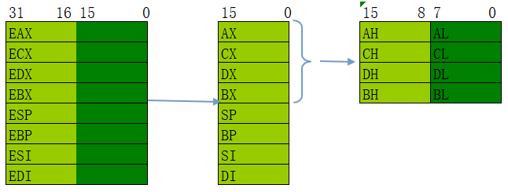
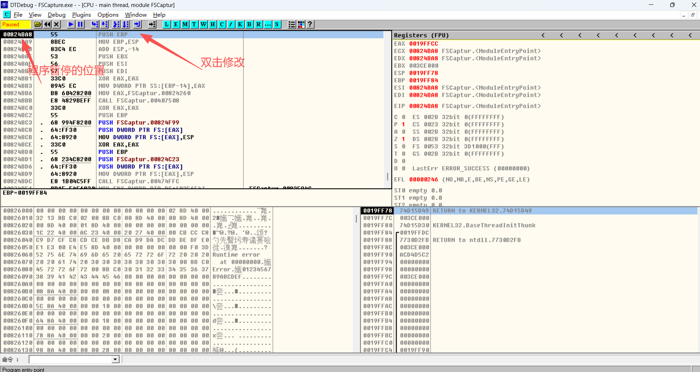
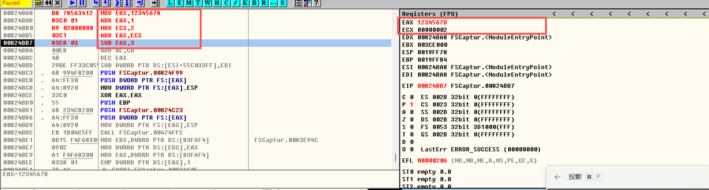

# 寄存器

## 寄存器的基本概念

计算机存储数据的地方，有三个地方：`CPU` > `内存` > `硬盘`
其中，`寄存器`是指 CPU 内部用来存储数据的高速存储单元。
如果你使用的是一个 32 位的 CPU，那么它能提供的寄存器通常有：8 位、16 位、32 位的访问形式。

## 通用寄存器

在 CPU 里面，寄存器分很多类：

- **通用寄存器（General Purpose Register, GPR）**
  → 可以存数据、存地址、存中间运算结果，用途比较广。
- **专用寄存器**
  → 有固定功能，不能随便用，比如：
  - EIP：指令指针寄存器，存放下一条要执行指令的地址
  - EFLAGS：标志寄存器，存放运算结果的标志位（零/进位/溢出等）
  - 段寄存器：负责内存分段管理

因为通用寄存器不像 EIP、EFLAGS 那样被“锁死”在某个功能上，而是**灵活多用**，所以才叫 **通用**。

## x86 架构中的 32 位通用寄存器

在 32 位 CPU 中，常见的通用寄存器有 8 个：
| 寄存器 | 编号 | 存储数据范围   |
| ------ | ---- | -------------- |
| EAX    | 0    | 0 - 0xFFFFFFFF |
| ECX    | 1    | 0 - 0xFFFFFFFF |
| EDX    | 2    | 0 - 0xFFFFFFFF |
| EBX    | 3    | 0 - 0xFFFFFFFF |
| ESP    | 4    | 0 - 0xFFFFFFFF |
| EBP    | 5    | 0 - 0xFFFFFFFF |
| ESI    | 6    | 0 - 0xFFFFFFFF |
| EDI    | 7    | 0 - 0xFFFFFFFF |

- 每个寄存器都是独立的存储单元
- 每个寄存器固定大小：32 位 → 4 字节
- 它们可以同时存储不同的数据，互不干扰，EAX 装的数据不会“占用” EBX、ECX 的空间。

> 虽然名字上都算“通用寄存器”，但在实际编程时它们会有**习惯性用途**：虽然名字上都叫“通用寄存器”，但在实际编程时，它们往往有**习惯性用途**：
>
> - EAX：累加器（运算结果常放在这）
> - ECX：计数器（循环次数常放这）
> - EDX：数据寄存器（扩展乘除法时存高位）
> - EBX：基址寄存器（有时存地址）
> - ESI / EDI：源地址 / 目的地址寄存器（字符串操作常用）
> - ESP / EBP：与栈相关（函数调用时常用）
>
> 但这些用途**不是强制的**，编译器或程序员完全可以把它们当普通存储单元来使用。


## 子寄存器

1.**子寄存器概念**

一个寄存器内部可以继续拆分成更小的“子寄存器”。

```
EAX (32位) = 0x12345678
   ├── 高16位 = 0x1234   ← 没有专门的寄存器名
   └── AX (低16位) = 0x5678
         ├── AH (高8位) = 0x56
         └── AL (低8位) = 0x78
```

- 修改 **AL** → AX / EAX 的低 8 位会被改变
- 修改 **AX** → EAX 的低 16 位会被改变
- 修改 **EAX** → 整个 32 位寄存器会被改变
- 这些修改**不会影响其他寄存器**（如 EBX、ECX）

```c
可以在OllyDbg上验证：
MOV EAX,0xAAAAAAAA	
MOV AX,0xBBBB	
MOV AH,0xCC	
MOV AL,0xDD	
```


2.**子寄存器存在的原因**

- **兼容历史**
   x86 架构从 **8 位 → 16 位 → 32 位 ** 逐步演进。
   为了让早期程序在新 CPU 上仍能运行，Intel 保留了子寄存器的访问方式。
- **灵活性**
  有时候只需要处理 1 字节（8 位）或 2 字节（16 位）的数据，直接用子寄存器效率更高，不必操作整个32位寄存器。


| 32位寄存器 | 16位子寄存器 | 有无8位子寄存器 | 高8位 | 低8位 | 示例值（32/16/8位）             | 编号（二进制/十进制） |
| :--------- | ------------ | --------------- | ----- | ----- | ------------------------------- | --------------------- |
| EAX        | AX           | ✅               | AH    | AL    | 0x12345678 / 0x5678 / 0x56/0x78 | 000 / 0               |
| ECX        | CX           | ✅               | CH    | CL    | 0x12345678 / 0x5678 / 0x56/0x78 | 001 / 1               |
| EDX        | DX           | ✅               | DH    | DL    | 0x12345678 / 0x5678 / 0x56/0x78 | 010 / 2               |
| EBX        | BX           | ✅               | BH    | BL    | 0x12345678 / 0x5678 / 0x56/0x78 | 011 / 3               |
| ESP        | SP           | ❌               | —     | —     | 0x12345678 / 0x5678 / —         | 100 / 4               |
| EBP        | BP           | ❌               | —     | —     | 0x12345678 / 0x5678 / —         | 101 / 5               |
| ESI        | SI           | ❌               | —     | —     | 0x12345678 / 0x5678 / —         | 110 / 6               |
| EDI        | DI           | ❌               | —     | —     | 0x12345678 / 0x5678 / —         | 111 / 7               |

         

# 认识OllyDbg

## 按`F3`打开一个EXE程序


## 修改寄存器中值

如何自己写汇编指令，双击程序正在执行的地址那一行的指令，可以新添加指令或者修改指令，最后按Assemble添加或修改成功。添加或修改后，这条指令会作为程序即将执行的指令，当按`F8`时，程序会执行你新添加的指令，添加多条，会依次向下覆盖，程序执行处在第一条你新添加的指令地址处



> 注意因为寄存器是32位的，所以如果地址数值大于了32位，即会从低位取32位，多余的位将被丢弃MOV EAX,123456789   #会变成23456789 
>

```
MOV EAX,12345678     #MOV是汇编指令，EAX是寄存器，后面的数叫立即数，此指令的作用就是将立即数存在EAX中
ADD EAX,1          #将1与EAX中已经存储的数做加法运算，结果再存储在EAX中
MOV ECX,2
ADD EAX,ECX       #将EAX与ECX中的值相加，将结果再放入EAX中
SUB EAX,3         #用EAX中的值-3，再将结果放入EAX中
```



# 汇编指令

## 指令作用与操作数表

| 指令 | 作用             | 目标操作数  | 源操作数           | 宽度要求                             |
| ---- | ---------------- | ----------- | ------------------ | ------------------------------------ |
| MOV  | 复制数据不改变源 | 寄存器/内存 | 寄存器/内存/立即数 | 必须一致（短补零，长截断）           |
| ADD  | 相加并存回目标   | 寄存器/内存 | 寄存器/内存/立即数 | 源可与目标宽度不一致（立即数可不同） |
| SUB  | 相减并存回目标   | 寄存器/内存 | 寄存器/内存/立即数 | 源可与目标宽度不一致（立即数可不同） |
| AND  | 与 → 存回目标    | 寄存器/内存 | 寄存器/内存/立即数 | 源可与目标宽度不一致（立即数可不同） |
| OR   | 或 → 存回目标    | 寄存器/内存 | 寄存器/内存/立即数 | 源可与目标宽度不一致（立即数可不同） |
| XOR  | 异或 → 存回目标  | 寄存器/内存 | 寄存器/内存/立即数 | 源可与目标宽度不一致（立即数可不同） |
| NOT  | 非 → 存回操作数  | 寄存器/内存 | —                  | 单操作数                             |


## 常用语法示例
### MOV（数据传送）

```
# 语法：MOV r32, imm32
# EAX = 0x12345678
MOV EAX, 0x12345678
# 结果 EAX = 0x12345678

# 语法：MOV r32, r32/m32
# EBX = EAX
MOV EBX, EAX
# 结果 EBX = 0x12345678

# 语法：MOV r32, r32/m32
# ECX = [0x00400000]（假设内存值=0x10）
MOV ECX, [0x00400000]
# 结果 ECX = 0x10

# 语法：MOV r32/m32, r32
# [0x00400000] = EAX
MOV [0x00400000], EAX
# 结果 [0x00400000] = 0x12345678

```
### ADD（加法）

```C
# 语法：ADD r32, imm32
# EAX = EAX + 0x3（假设初始EAX=0x5）
MOV EAX, 0x5
ADD EAX, 0x3
# 结果 EAX = 0x8

# 语法：ADD r32, r32/m32
# EAX = EAX + EBX（假设EAX=0x10, EBX=0x4）
MOV EAX, 0x10
MOV EBX, 0x4
ADD EAX, EBX
# 结果 EAX = 0x14

# 语法：ADD r32, r32/m32
# EAX = EAX + [0x00400000]（假设内存值=0x7）
MOV EAX, 0
ADD EAX, [0x00400000]
# 结果 EAX = 0x7
```
### SUB（减法）

```C
# 语法：SUB r32, imm32
# EAX = EAX - 0x3（假设初始EAX=0x10）
MOV EAX, 0x10
SUB EAX, 0x3
# 结果 EAX = 0xD

# 语法：SUB r32, r32/m32
# EAX = EAX - EBX（假设EAX=0x20, EBX=0x5）
MOV EAX, 0x20
MOV EBX, 0x5
SUB EAX, EBX
# 结果 EAX = 0x1B

# 语法：SUB r32, r32/m32
# EAX = EAX - [0x00400000]（假设内存值=0x4）
MOV EAX, 0x10
SUB EAX, [0x00400000]
# 结果 EAX = 0xC
```
### AND（按位与）

```C
# 语法：AND r32, imm32
# EAX = EAX & 0x0F（假设初始EAX=0xFF）
MOV EAX, 0xFF
AND EAX, 0x0F
# 结果 EAX = 0x0F

# 语法：AND r32, r32/m32
# EAX = EAX & EBX（假设EAX=0xF0, EBX=0x0F）
MOV EAX, 0xF0
MOV EBX, 0x0F
AND EAX, EBX
# 结果 EAX = 0x00

# 语法：AND r32, r32/m32
# EAX = EAX & [0x00400000]（假设内存值=0x0F）
MOV EAX, 0xFF
AND EAX, [0x00400000]
# 结果 EAX = 0x0F
```
### OR（按位或）

```C
# 语法：OR r32, imm32
# EAX = EAX | 0xF（假设初始EAX=0x0）
MOV EAX, 0x0
OR EAX, 0xF
# 结果 EAX = 0xF

# 语法：OR r32, r32/m32
# EAX = EAX | EBX（假设EAX=0x10, EBX=0x01）
MOV EAX, 0x10
MOV EBX, 0x01
OR EAX, EBX
# 结果 EAX = 0x11

# 语法：OR r32, r32/m32
# EAX = EAX | [0x00400000]（假设内存值=0x05）
MOV EAX, 0
OR EAX, [0x00400000]
# 结果 EAX = 0x5
```
### XOR（按位异或）

```C
# 语法：XOR r32, imm32
# EAX = EAX ^ 0xFF（假设初始EAX=0x55）
MOV EAX, 0x55
XOR EAX, 0xFF 
# 结果 EAX = 0xAA

# 语法：XOR r32, r32/m32
# EAX = EAX ^ EBX（假设EAX=0xAA, EBX=0x0F）
MOV EAX, 0xAA
MOV EBX, 0x0F
XOR EAX, EBX
# 结果 EAX = 0xA5

# 语法：XOR r32, r32/m32
# EAX = EAX ^ [0x00400000]（假设内存值=0x05）
MOV EAX, 0
XOR EAX, [0x00400000]
# 结果 EAX = 0x5
```
### NOT（按位取反）

```C
# 语法：NOT r32/m32
# EAX = ~EAX（假设初始EAX=0x0F）
MOV EAX, 0x0F
NOT EAX
# 结果 EAX = 0xFFFFFFF0

# 语法：NOT r8/m8
# AL = ~AL（假设初始AL=0x0F）
MOV AL, 0x0F
NOT AL
# 结果 AL = 0xF0

# 语法：NOT r32/m32
# [0x00400000] = ~[0x00400000]（假设内存值=0x0F）
NOT [0x00400000]
# 结果 [0x00400000] = 0xF0
```
> r 通用寄存器；m 代表内存；imm 代表立即数；r8 代表8位通用寄存器；m8 代表8位内存；imm8 代表8位立即数
>
> 源、目标不能同时为内存
>
> - 寄存器 ← 寄存器
> - 寄存器 ← 内存
> - 寄存器 ← 立即数
> - 内存 ← 寄存器
>

## 汇编指令总结

1️⃣ MOV（数据传送）

- **作用**：把一个值从寄存器、内存或立即数，传送到另一个寄存器或内存。
- **底层实现**：
  - 不经过加法器或逻辑运算
  - 只是 **把数据直接写入目标寄存器/内存**
  - 硬件上通常是 **总线传输 + 寄存器写入**，可能会有时序控制
- 简单来说，MOV 就是 **数据搬运**，不做数学计算。

------

2️⃣ ADD/SUB

- **作用**：执行数学运算
- **底层实现**：
  - 统一用 **加法器 + 补码**（SUB 通过补码转换）
  - 每一位用逻辑门（XOR、AND、OR、NOT）处理
- 本质上是 **数学计算 + 位运算**。

3️⃣ 总结对比

| 指令           | 本质     | 底层                          |
| -------------- | -------- | ----------------------------- |
| MOV            | 数据搬运 | 总线传输 + 寄存器/内存写入    |
| ADD            | 加法     | 加法器 + 逻辑门（XOR/AND/OR） |
| SUB            | 减法     | 加法器 + 补码 + 逻辑门        |
| AND/OR/XOR/NOT | 按位运算 | 逻辑门（XOR/AND/OR/NOT）      |

